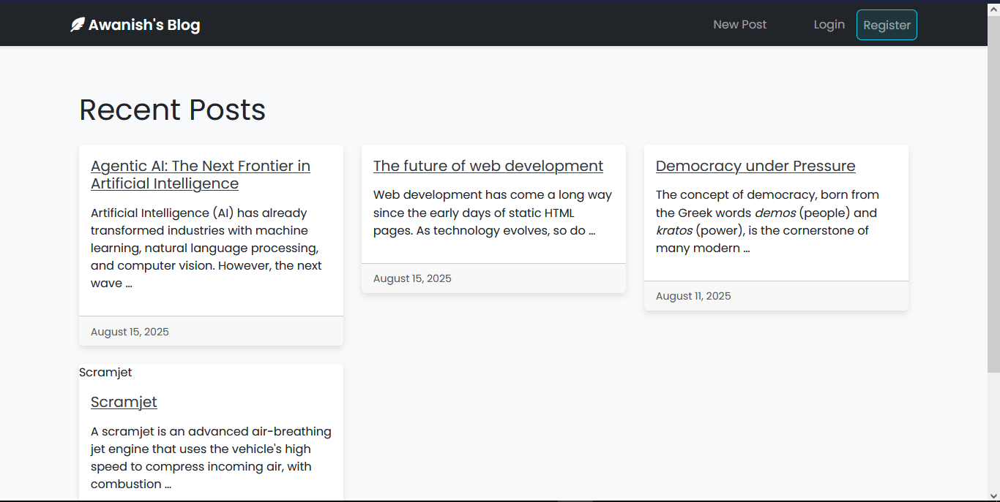

# BlogXAwa

A Markdown-powered blog with user accounts, likes, profile page, and banner images stored in Supabase Storage. Built on Django 5 with a PostgreSQL backend and Vercel deployment support.



## Highlights

- Markdown posts with fenced-code support
- Auth: register, login, logout, password reset, password change
- Post CRUD with image banners stored in Supabase Storage
- Likes per post
- Profile page (dashboard)
- Vercel-ready build pipeline

## Tech Stack

- Django 5.2
- PostgreSQL (Supabase)
- Supabase Storage
- Python Markdown

## Project Structure

```
myblog/
	manage.py
	myblog/            # project settings + urls
	blog/              # posts, likes, Markdown rendering
	authentication/    # user registration + auth forms
	dashboard/         # profile view
	templates/         # HTML templates
	static/            # CSS/JS assets
	staticfiles/       # collected static output
```

## Quickstart (Local)

1. Create and activate a virtual environment.
2. Install dependencies.
3. Set environment variables.
4. Run migrations.
5. Start the server.

```bash
python -m venv .venv
# Windows
.venv\Scripts\activate
# macOS/Linux
source .venv/bin/activate

pip install -r requirements.txt
python myblog/manage.py migrate
python myblog/manage.py runserver
```

Open: http://127.0.0.1:8000/

## Environment Variables

Create a .env file or export these in your shell (loaded in settings):

```
SECRET_KEY=your-django-secret-key
SUPABASE_KEY=your-supabase-service-key
```

Notes:

- The project currently points to a Supabase PostgreSQL database in settings. For local dev, update the database config in myblog/settings.py or provide environment-driven values.
- Supabase Storage bucket name used: uploads

## Common Commands

```bash
python myblog/manage.py createsuperuser
python myblog/manage.py collectstatic --no-input
python myblog/manage.py test
```

## Deployment (Vercel)

This project includes vercel.json and a build script.

- Build script: myblog/build_files.sh
- Vercel config: myblog/vercel.json
- Static assets collected to staticfiles/

Deploy steps:

1. Set environment variables in Vercel:
   - SECRET_KEY
   - SUPABASE_KEY
2. Deploy from the repo root.
3. Vercel runs build_files.sh and serves via WSGI.

## Features in Detail

- Markdown: Posts are rendered using the fenced-code extension.
- Images: Banner images are uploaded to Supabase Storage with UUID file names.
- Likes: Simple like/unlike toggle per user.
